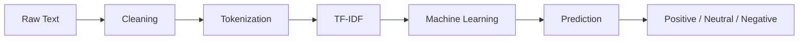

 

  

---

### Sentiment Analysis using Machine Learning

Transform raw text into meaningful insights using Natural Language Processing and Machine Learning.

Designed to classify text into

😊 Positive • 😐 Neutral • 😔 Negative

with real-time predictions and an intuitive web interface.

| Feature | Description |
|---------|-------------|
| ⚡ Fast Prediction | Real-time sentiment analysis |
| 🧠 Machine Learning | TF-IDF + Scikit-learn |
| 📝 NLP Pipeline | Cleaning, Tokenization, Stopword Removal |
| 💾 Model Persistence | Joblib |
| 🌐 Web Interface | Flask / Streamlit |

━━━━━━━━━━━━━━━━━━━━━━━━━━━━━━━━━━━━━━━━━━━━

*"Turning text into intelligence with Machine Learning."*

