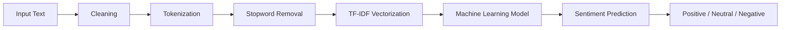

# 😊 Sentiment Analysis using Machine Learning

<div align="center">


<br>


<br><br>

<p>


</p>

</div>

---

## Overview

**Sentiment Analysis using Machine Learning** is a Natural Language Processing (NLP) project that classifies text into one of three sentiment categories:

* 😊 Positive
* 😐 Neutral
* 😔 Negative

The application follows a complete machine learning workflow—from text preprocessing and feature engineering to model training and real-time prediction through a simple web interface.

---

## Preview

> Add screenshots after uploading them to the `assets/` folder.

| Home                 | Prediction                 |
| -------------------- | -------------------------- |
|  |  |

---

## Features

* ✨ Real-time sentiment prediction
* 🧹 Text preprocessing pipeline
* 🔤 Tokenization
* 🚫 Stopword removal
* 📊 TF-IDF feature extraction
* 🤖 Machine Learning classification
* 💾 Saved trained model
* 🌐 Web interface
* 📈 Performance evaluation
* ⚡ Fast predictions

---

## Machine Learning Pipeline



---

## Tech Stack

| Category         | Technology        |
| ---------------- | ----------------- |
| Language         | Python            |
| Machine Learning | Scikit-learn      |
| NLP              | NLTK              |
| Data Processing  | Pandas, NumPy     |
| Model Storage    | Joblib            |
| Web Framework    | Flask / Streamlit |
| Version Control  | Git & GitHub      |

---

## Project Structure

```text
sentimental_analysis/

├── assets/
│   ├── home.png
│   ├── prediction.png
│   └── result.png
│
├── data/
│   └── dataset.csv
│
├── models/
│   ├── sentiment_model.pkl
│   └── vectorizer.pkl
│
├── notebooks/
│   └── sentiment_analysis.ipynb
│
├── utils/
│   ├── preprocessing.py
│   └── prediction.py
│
├── app.py
├── main.py
├── requirements.txt
├── README.md
└── .gitignore
```

---

## Installation

### Clone Repository

```bash
git clone https://github.com/Shrutisinha/sentimental_analysis.git
```

### Enter Project

```bash
cd sentimental_analysis
```

### Create Virtual Environment

```bash
python -m venv venv
```

### Activate

Windows

```bash
venv\Scripts\activate
```

Linux / macOS

```bash
source venv/bin/activate
```

### Install Dependencies

```bash
pip install -r requirements.txt
```

---

## Run the Application

Flask

```bash
python app.py
```

or

Streamlit

```bash
streamlit run app.py
```

---

## Example

**Input**

```text
The movie was absolutely amazing and I loved every moment.
```

**Prediction**

```text
Positive 😊
```

---

## Model Workflow

```text
Dataset
    │
    ▼
Text Cleaning
    │
    ▼
Tokenization
    │
    ▼
Stopword Removal
    │
    ▼
TF-IDF
    │
    ▼
Model Training
    │
    ▼
Model Saving
    │
    ▼
Prediction
```

---

## Performance

| Metric    | Value |
| --------- | ----: |
| Accuracy  |  XX % |
| Precision |  XX % |
| Recall    |  XX % |
| F1 Score  |  XX % |

Replace the placeholder values with your actual evaluation results.

---

## Future Improvements

* BERT-based sentiment analysis
* LSTM implementation
* Transformer models
* Emotion detection
* Multi-language support
* Speech sentiment analysis
* REST API
* Docker deployment
* Cloud deployment
* CI/CD integration

---

## Contributing

Contributions are welcome.

1. Fork the repository.
2. Create a feature branch.

```bash
git checkout -b feature/new-feature
```

3. Commit your changes.

```bash
git commit -m "Add new feature"
```

4. Push the branch.

```bash
git push origin feature/new-feature
```

5. Open a Pull Request.

---

## Author

### Shruti Sinha

* GitHub: https://github.com/Shrutisinha

---

## Support

If this project helped you, consider giving it a ⭐ on GitHub.

---

<div align="center">

*"Artificial Intelligence begins with understanding language."*

<br><br>


</div>
