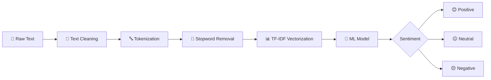

<div align="center">


<br>


<br><br>


<br><br>

<a href="#-overview">Overview</a> • <a href="#-features">Features</a> • <a href="#-architecture">Architecture</a> • <a href="#-installation">Installation</a> • <a href="#-usage">Usage</a> • <a href="#-results">Results</a>

</div>

---

<p align="center">

</p>

## 📌 Overview

**Sentiment Analysis** is a Natural Language Processing project that uses Machine Learning to identify the emotional tone of textual data.

The system processes raw text, applies a complete NLP preprocessing pipeline, converts language into numerical features using **TF-IDF**, and uses a trained Machine Learning model to classify the input into:

<p align="center">

😊 <b>Positive</b>    •   
😐 <b>Neutral</b>    •   
😔 <b>Negative</b>

</p>

The project also provides a **web-based interface** for real-time sentiment prediction, making the trained model accessible beyond a notebook environment.

---

## ✨ Key Features

<table>
<tr>
<td width="50%">

### 🧠 Intelligent Classification

Uses Machine Learning algorithms to identify sentiment from textual input.

### 🔤 NLP Preprocessing

Cleans and prepares raw text through tokenization, normalization, and stopword removal.

### 📊 TF-IDF Vectorization

Transforms textual data into meaningful numerical features for model training.

</td>

<td width="50%">

### ⚡ Real-Time Prediction

Analyze user-provided text instantly through the web application.

### 💾 Model Persistence

Trained models and vectorizers are stored using Joblib for reuse without retraining.

### 🌐 Web Application

Simple and intuitive interface for interacting with the trained sentiment classifier.

</td>
</tr>
</table>

---

## 🏗️ Architecture


```mermaid
flowchart LR
    A["📝 Raw Text"] --> B["🧹 Text Cleaning"]
    B --> C["🔤 Tokenization"]
    C --> D["🚫 Stopword Removal"]
    D --> E["📊 TF-IDF Vectorization"]
    E --> F["🤖 ML Model"]
    F --> G{"Sentiment"}
    G --> H["😊 Positive"]
    G --> I["😐 Neutral"]
    G --> J["😔 Negative"]
```

### 🔄 Processing Pipeline

```text
Raw Input
    ↓
Text Normalization
    ↓
Cleaning & Preprocessing
    ↓
Tokenization
    ↓
Stopword Removal
    ↓
TF-IDF Feature Extraction
    ↓
Machine Learning Classification
    ↓
Sentiment Prediction
```

---

## 🛠️ Tech Stack

| Category               | Technologies               |
| ---------------------- | -------------------------- |
| **Language**           | Python                     |
| **Machine Learning**   | Scikit-learn               |
| **NLP**                | NLTK                       |
| **Feature Extraction** | TF-IDF                     |
| **Model Persistence**  | Joblib                     |
| **Web Framework**      | Flask                      |
| **Data Processing**    | Pandas, NumPy              |
| **Development**        | VS Code / Jupyter Notebook |

---

## 📂 Project Structure

```text
sentiment-analysis/
│
├── 📁 static/
│   ├── css/
│   └── js/
│
├── 📁 templates/
│   └── index.html
│
├── 📄 app.py
├── 📄 train.py
├── 📄 predict.py
├── 📄 preprocess.py
├── 📄 requirements.txt
│
├── 📦 model.pkl
├── 📦 vectorizer.pkl
│
├── 📊 dataset.csv
├── 📓 sentiment_analysis.ipynb
│
└── 📖 README.md
```

> **Note:** Update the structure above if your repository uses different filenames or folders.

---

## ⚙️ Installation

### 1️⃣ Clone the Repository

```bash
git clone https://github.com/Shrutisinha/sentiment-analysis.git
cd sentiment-analysis
```

### 2️⃣ Create a Virtual Environment

**Windows**

```bash
python -m venv venv
venv\Scripts\activate
```

**macOS / Linux**

```bash
python3 -m venv venv
source venv/bin/activate
```

### 3️⃣ Install Dependencies

```bash
pip install -r requirements.txt
```

### 4️⃣ Download Required NLTK Resources

```bash
python -m nltk.downloader stopwords punkt
```

---

## 🚀 Usage

### Train the Model

```bash
python train.py
```

The training pipeline performs:

```text
Dataset Loading
      ↓
Text Preprocessing
      ↓
TF-IDF Feature Extraction
      ↓
Model Training
      ↓
Model Evaluation
      ↓
Model + Vectorizer Saving
```

The trained model and vectorizer are saved for future predictions.

---

### 🌐 Run the Web Application

```bash
python app.py
```

Then open:

```text
http://localhost:5000
```

Enter a sentence such as:

```text
"This product exceeded my expectations!"
```

The application returns the predicted sentiment in real time.

---

### 🐍 Use the Model Programmatically

```python
from predict import predict_sentiment

result = predict_sentiment(
    "This product exceeded my expectations!"
)

print(result)
```

Example:

```text
Positive 😊
```

---

## 📊 Model Performance

| Model                  | Accuracy | F1-Score |
| :--------------------- | :------: | :------: |
| Logistic Regression    |   ~88%   |   0.87   |
| Naive Bayes            |   ~85%   |   0.84   |
| Support Vector Machine | **~89%** | **0.88** |
| Random Forest          |   ~86%   |   0.85   |
| Gradient Boosting      |   ~87%   |   0.86   |

### 🏆 Best Model

The **Support Vector Machine (SVM)** achieved the strongest performance among the evaluated models, with approximately:

**89% Accuracy** • **0.88 F1-Score**

> Performance may vary depending on the dataset, preprocessing strategy, train/test split, and model configuration.

---

## 🧪 Example Predictions

| Input                                   | Prediction  |
| --------------------------------------- | ----------- |
| `"I absolutely loved this experience!"` | 😊 Positive |
| `"The service was okay."`               | 😐 Neutral  |
| `"This was a terrible experience."`     | 😔 Negative |

---

## 💡 What This Project Demonstrates

* Natural Language Processing fundamentals
* Text preprocessing and normalization
* TF-IDF feature engineering
* Supervised Machine Learning
* Model comparison and evaluation
* Classification metrics
* Model serialization with Joblib
* Flask-based Machine Learning deployment
* Python project structuring
* End-to-end ML workflow

---

## 🔮 Future Improvements

* [ ] Add larger and more diverse datasets
* [ ] Implement deep-learning-based sentiment models
* [ ] Add emotion classification beyond positive/neutral/negative
* [ ] Add confidence scores to predictions
* [ ] Add sentiment visualization and analytics
* [ ] Deploy the application to a cloud platform
* [ ] Add REST API support
* [ ] Improve handling of sarcasm and contextual language
* [ ] Add automated model retraining

---

## 📈 Future Vision

The project can be extended into a broader **Customer Feedback Intelligence Platform** capable of analyzing large volumes of reviews, comments, and feedback.

Potential applications include:

```text
Customer Reviews
       ↓
Sentiment Detection
       ↓
Emotion & Topic Analysis
       ↓
Trend Identification
       ↓
Business Insights
```

---

## 👩‍💻 Author

<div align="center">

### Shruti Sinha

**B.Tech CSE | Machine Learning | Data Analytics | NLP**

Building practical solutions with
**Python • Machine Learning • Data Analytics • NLP**

<br>

<a href="https://github.com/Shrutisinha">

</a>

</div>

---

## ⭐ Support

If you found this project useful or interesting, consider giving the repository a ⭐ on GitHub.

<p align="center">

**Machine Learning • NLP • Text Intelligence**

</p>

<div align="center">


### *"Turning text into intelligence with Machine Learning."*

</div>
