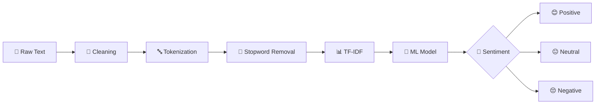

<div align="center">

<!-- Animated Header -->


<br>

<!-- Typing Animation -->


<br><br>

<!-- Tech Stack -->


<br><br>


</div>

---

<!-- Animated Illustration -->

<p align="center">

</p>

## 🧠 Sentiment Analysis

> **Turning human language into actionable intelligence using Machine Learning and Natural Language Processing.**

This project analyzes textual data and automatically classifies sentiment into:

<p align="center">

😊 **Positive**    •   
😐 **Neutral**    •   
😔 **Negative**

</p>

The system combines **NLP preprocessing**, **TF-IDF feature extraction**, and **Machine Learning classification** to provide fast and reusable sentiment predictions.

---

## ✨ Features

<table>
<tr>
<td align="center" width="33%">

### 🧹

**NLP Pipeline**

Text cleaning, tokenization and stopword removal.

</td>

<td align="center" width="33%">

### 📊

**TF-IDF**

Converts textual information into numerical features.

</td>

<td align="center" width="33%">

### 🤖

**ML Classification**

Predicts Positive, Neutral or Negative sentiment.

</td>
</tr>

<tr>
<td align="center">

### ⚡

**Real-Time**

Instant sentiment prediction.

</td>

<td align="center">

### 💾

**Model Persistence**

Models stored using Joblib.

</td>

<td align="center">

### 🌐

**Web Application**

Interactive Flask interface.

</td>
</tr>
</table>

---

## 🔄 ML Pipeline


```mermaid
flowchart LR
    A["📝 Raw Text"]
    B["🧹 Cleaning"]
    C["🔤 Tokenization"]
    D["🚫 Stopword Removal"]
    E["📊 TF-IDF"]
    F["🤖 ML Model"]
    G{"🎯 Sentiment"}

    A --> B --> C --> D --> E --> F --> G

    G --> H["😊 Positive"]
    G --> I["😐 Neutral"]
    G --> J["😔 Negative"]
```

---

## 🛠️ Tech Stack

<p align="center">


</p>

<p align="center">


</p>

---

## 📂 Project Structure

```text
sentiment-analysis/
│
├── 📁 static/
│   ├── css/
│   └── js/
│
├── 📁 templates/
│   └── index.html
│
├── 📄 app.py
├── 📄 train.py
├── 📄 predict.py
├── 📄 preprocess.py
├── 📄 requirements.txt
│
├── 📦 model.pkl
├── 📦 vectorizer.pkl
├── 📊 dataset.csv
│
├── 📓 sentiment_analysis.ipynb
└── 📖 README.md
```

---

## ⚙️ Installation

### 1. Clone Repository

```bash
git clone https://github.com/Shrutisinha/sentiment-analysis.git
cd sentiment-analysis
```

### 2. Create Virtual Environment

**Windows**

```bash
python -m venv venv
venv\Scripts\activate
```

**macOS / Linux**

```bash
python3 -m venv venv
source venv/bin/activate
```

### 3. Install Dependencies

```bash
pip install -r requirements.txt
```

### 4. Download NLTK Resources

```bash
python -m nltk.downloader stopwords punkt
```

---

## 🚀 Run the Project

### Train Model

```bash
python train.py
```

### Start Web Application

```bash
python app.py
```

Then open:

```text
http://localhost:5000
```

---

## 💻 Example

```python
from predict import predict_sentiment

result = predict_sentiment(
    "This product exceeded my expectations!"
)

print(result)
```

**Output:**

```text
Positive 😊
```

---

## 📊 Model Performance

| Model                  | Accuracy | F1-Score |
| :--------------------- | :------: | :------: |
| Logistic Regression    |   ~88%   |   0.87   |
| Naive Bayes            |   ~85%   |   0.84   |
| Support Vector Machine | **~89%** | **0.88** |
| Random Forest          |   ~86%   |   0.85   |
| Gradient Boosting      |   ~87%   |   0.86   |

### 🏆 Best Performance

**Support Vector Machine — ~89% Accuracy**

---

## 🔮 Future Enhancements

* [ ] 🎯 Add prediction confidence scores
* [ ] 😊 Add emotion detection
* [ ] 📈 Add sentiment analytics dashboard
* [ ] 🧠 Experiment with Deep Learning models
* [ ] 🌐 Deploy the application online
* [ ] 🔌 Add REST API
* [ ] 📊 Add interactive visualizations
* [ ] 🗣️ Improve sarcasm detection
* [ ] 🔄 Automated model retraining

---

## 📈 Project Workflow

```text
          📝 USER TEXT
               │
               ▼
        🧹 PREPROCESSING
               │
               ▼
        📊 TF-IDF FEATURES
               │
               ▼
          🤖 ML MODEL
               │
               ▼
       🎯 SENTIMENT RESULT
          /      |      \
         /       |       \
        ▼        ▼        ▼
      😊        😐        😔
   Positive   Neutral   Negative
```

---

## 📊 GitHub Activity

<div align="center">


</div>

<br>

<!-- Contribution Animation -->

<p align="center">

</p>

---

## 👩‍💻 Author

<div align="center">

### **Shruti Sinha**

**B.Tech CSE | Machine Learning | Data Analytics | NLP**

<br>

<a href="https://github.com/Shrutisinha">

</a>

</div>

---

<div align="center">


<br><br>


</div>
